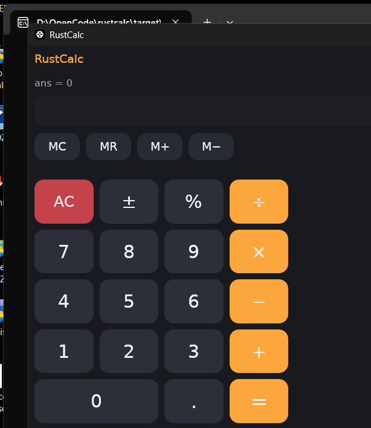

# RustCalc

Uma calculadora gráfica bonita e funcional escrita em **Rust**, com modo
**básico** e modo **científico**, memória, teclado, tema escuro e acento
laranja — tudo sem nenhuma dependência além de [egui/eframe](https://github.com/emilk/egui).



## Funcionalidades

- **Modo básico** — as quatro operações, porcentagem, troca de sinal, vírgula,
  limpar (AC) e igual.
- **Modo científico** — trigonometria (com DEG/RAD), logaritmos, raízes,
  exponenciação, fatorial, constante π e *e*, valor absoluto, máximo/mínimo…
- **Memória** — `MC`, `MR`, `M+`, `M−` com indicador visual.
- **Entrada flexível** — teclado físico e mouse; parênteses são fechados
  automaticamente; multiplicação implícita (`2π`, `2(3)`).
- **Resultado contínuo** — use o `ans` da última conta em uma nova expressão.
- **Engine própria** com parser recursivo-descendente testado.

## Como executar

Requisitos: [Rust](https://rustup.rs) (edition 2021, MSRV 1.85).

```sh
cargo run --release
```

Desenvolver e testar:

```sh
cargo build
cargo test
cargo clippy --all-targets -- -D warnings
cargo fmt --check
```

## Estrutura do projeto

```
.
├── Cargo.toml            # eframe (GUI); engine é stdlib pura
├── assets/fonts/         # DejaVu (símbolos matemáticos corretos)
├── docs/screenshot-basic.png
├── src/
│   ├── main.rs           # aplicação GUI (modos básico e científico)
│   ├── lib.rs
│   └── eval.rs           # tokenizador + parser + avaliador (100% testado)
└── tests/eval.rs         # testes de integração da engine
```

## Documentação

- [Manual.md](Manual.md) — guia de uso da interface e sintaxe.
- [AGENTS.md](AGENTS.md) — guia de desenvolvimento (comandos, convenções).

## Licença

MIT — veja [LICENSE](LICENSE).